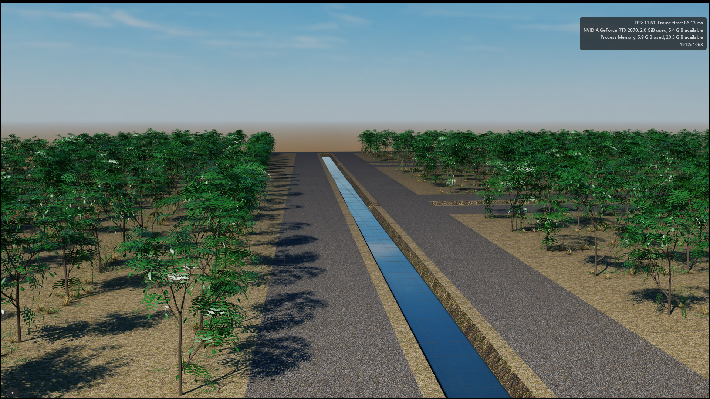

# farm-generator
Procedural farm generation via intermediate representation for robotics simulations. Tools for conversion to (minimally) IsaacSim/USD.

See `CLAUDE.md` for the full architecture/design reference.

## Setup

This repo uses the `usd2508` conda environment (shared with the USD/IsaacSim
tooling this project eventually exports to), not a Python venv.

```bash
conda activate usd2508
pip install -e ".[dev]"
```

That installs this package (editable) plus its runtime dependencies (numpy,
shapely, networkx, scipy, matplotlib, pyyaml) and dev dependencies (pytest),
all pinned in `pyproject.toml`. Re-run the `pip install` after pulling
changes that touch `pyproject.toml`.

If `usd2508` doesn't exist yet on your machine: `conda create -n usd2508
python=3.12` (any Python >= 3.10 works), then activate and `pip install` as
above.

## Running the tests

```bash
conda activate usd2508
python -m pytest tests/ -q
```

## Running the debug visualizer

`visualization/debug_view.py` is the primary dev tool (see CLAUDE.md
"Visualization"). Run it as a module from the repo root:

```bash
conda activate usd2508
python -m visualization.debug_view
```

This generates a farm for 5 seeds and writes, per seed, into
`debug_out/farm_scenes/`:
- `farm_seed_<N>.png` — a static plot (parcels/roads/crossings/trees/weed
  zones), at 300 DPI so tree-level detail is actually legible.
- `farm_seed_<N>.yaml` — the full `FarmScene` IR plus the
  `FarmGenerationConfig` that produced it (see `farm_ir/serialize.py`),
  human-readable and round-trippable. This is what a future USD/Gazebo
  exporter will read as input.

`debug_out/` is scratch output (gitignored, aside from whatever's already
checked in for reference) — safe to delete and regenerate at any time.

## Running the example prototype

`examples/farm_mesh_prototype.py` is a self-contained reference prototype
(see CLAUDE.md "Example reference code") — read it as a spec of behavior,
not production code. Run directly:

```bash
conda activate usd2508
python examples/farm_mesh_prototype.py
```

It generates and validates 5 seeds and saves plots to
`debug_out/examples/`.

## Generating hydrology ground meshes

Run `python examples/generate_procedural_assets.py` first to build the reusable,
fully procedural tree and weed prototype library. Then run
`python examples/generate_ground_meshes.py` to generate five 60 m by 60 m farm
IRs and corresponding USDA worlds in `debug_out/mesh/`. All five diagnostic
farms enable optimized tree-row orientation. Run
`python examples/generate_showcase_farm.py` separately to build the larger
120 m by 120 m presentation scene without replacing those regression cases.
The exporter uses deterministic Poisson-disc (blue-noise) points, producing
an amorphous Delaunay/Voronoi-dual mesh, plus exact constrained breaklines at
the shoulders and flat bottoms of the trapezoidal irrigation channels.
Each seed also produces a wireframe PNG showing all vertices, triangle edges,
and constrained breaklines classified by source: road boundaries in red,
channel contours in orange, and crossing/channel-slope intersections in purple.

The example enables exporter-side lateral channel undulation with a 10 cm
maximum amplitude, wavelengths strictly greater than 1 m, and 1 m curve
sampling. `ChannelUndulationConfig` controls these values and an optional seed
offset. Perturbations are deterministic per farm seed and logical hydrology
edge, taper to zero at network nodes, and are applied before deriving both the
channel shoulder and bottom breaklines. The `FarmScene` IR is not modified.

Before constructing the PSLG, the exporter creates first-class `ChannelFace`
objects. Each face corresponds to one parcel-side hydrology edge and owns its
paired shoulder and bottom arcs, exact shared corner endpoints, depth, and
endpoint cross-slope ribs. GEOS computes valid offset contours; those contours
are split at analytically determined corner stations and mapped one-to-one to
their source hydrology edges. This avoids recovering corners by nearby-vertex
indices and provides a reusable surface-patch representation for later roads
and bridge approaches.

At every authored parcel corner, a transverse PSLG breakline connects the
shoulder to the bottom contour. This prevents constrained Delaunay from
choosing its own miter across the channel slope and establishes a reusable
surface-patch convention for later roads and structures.

The example uses a 3.5 m road standoff, 7.5 m headlands, and 6.5 m sidelands.
Straight 4 m-wide roads are represented as first-class `RoadSurfacePatch`
footprints. Road boundaries are PSLG constraints, and their triangles are
exported in the USD `RoadFaces` geometry subset for later material binding.

Road footprints replace, rather than overlay, the underlying terrain mesh.
Channel constraints are clipped out wherever a road exists, road-side boundary
vertices are placed at road elevation, and explicit vertical triangles close
the channel-facing solid fill sides. No crossing-specific constraints cut
across the road top. Wall faces are exported in the `CrossingWalls` subset.
Each crossing is associated with the hydrology segment that geometrically
passes through its location, rather than by channel-midpoint proximity. The
purple wireframe diagnostics therefore cover the crossing/channel-slope
intersections at every crossing, including long channel segments.

Channel water is controlled by `hydrology_add_water` and
`hydrology_water_depth_fraction` in `FarmGenerationConfig`; the latter is the
filled fraction measured upward from the channel bottom. The waterline becomes
an additional ground-mesh PSLG contour. Each connected water polygon, after
subtracting road fills, is exported as a separate constrained `WaterSurface_*`
mesh with a transparent, reflective `UsdPreviewSurface` material, low
roughness, and an index of refraction of 1.333. The debug example enables water
at half channel depth and draws its closed boundaries in cyan.

Each USDA is a complete `/World` stage rather than a bare ground primitive. It
includes a `/World/Lights/Sky` dome light using
`assets/dome_texture_clouds.png`, a shadow-casting distant sun, a
gravity-enabled physics scene, and a static ground mesh collider. Material
geometry subsets map crushed grass to flat cropland, the channel texture to
slopes, bottoms, and vertical crossing walls, and darker gravel to road decks.
Face-varying world-space UVs repeat every texture at 2 m intervals. Vertical
crossing walls use horizontal-distance/elevation projection so their texture
does not collapse, while remaining independently identified by the
`CrossingWalls` subset.

Trees and weeds are authored as separate USD `PointInstancer` systems under
`/World/Vegetation`. Tree positions come directly from the farm IR. Each IR
weed zone records the exact cultivated row centerlines; weeds are sampled only
from Gaussian lateral profiles around those rows while excluding road and
channel footprints. `weed_row_density_per_m` is the expected instance count per
metre of row, integrated laterally, and `weed_row_falloff_m` is the lateral
standard deviation. Sampling is truncated at three standard deviations, with
no parcel-wide background weeds. Both systems reference the separately
generated prototype library; exporting a farm never silently generates or
mutates those assets. The diagnostic configuration uses 5 m row spacing and
4 m tree spacing and 4.5 expected weeds per row-metre. The current procedural
library contains four deterministic pecan-tree variants plus dry grass,
fennel, and ashweed. Individual tree and weed instances receive independently
seeded, repeatable random rotations about the vertical axis and modest scale
variation. Setting `optimize_tree_layout=True` retains the random
planting-grid anchor corner but uses the longer of its two incident parcel
edges as the tree-row direction; the default `False` preserves randomized
edge selection for layouts requiring more turns.

## 120 m showcase farm



This is an HD Isaac Sim render of the 120 m by 120 m showcase farm generated
by `examples/generate_showcase_farm.py`. Seed 1 produced 4 parcels, 16 channel
segments, 6 channel crossings, 453 trees selected from four procedural tree
variants, and 8,356 weeds concentrated along the optimized tree rows. The
complete run—including IR generation, ground and water meshing, USDA writing,
and diagnostic rendering—took approximately 2 minutes 10 seconds on the
development machine. The resulting USDA contains 33,616 ground vertices and
52,003 ground triangles and is written as
`debug_out/mesh/farm_seed_1_120m2_ground.usda`.

## Generating a farm programmatically

```python
from generation.orchestrator import FarmGenerationConfig, generate_validated, save_farm

config = FarmGenerationConfig(bounds=(0.0, 0.0, 100.0, 100.0), seed=1)
scene, issues, used_seed = generate_validated(config)
save_farm(scene, config, "my_farm.yaml")
```
