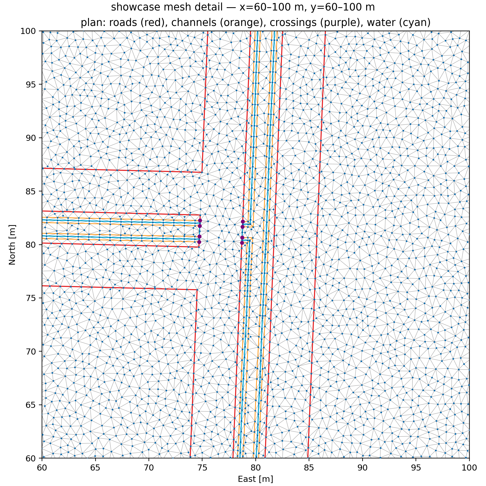
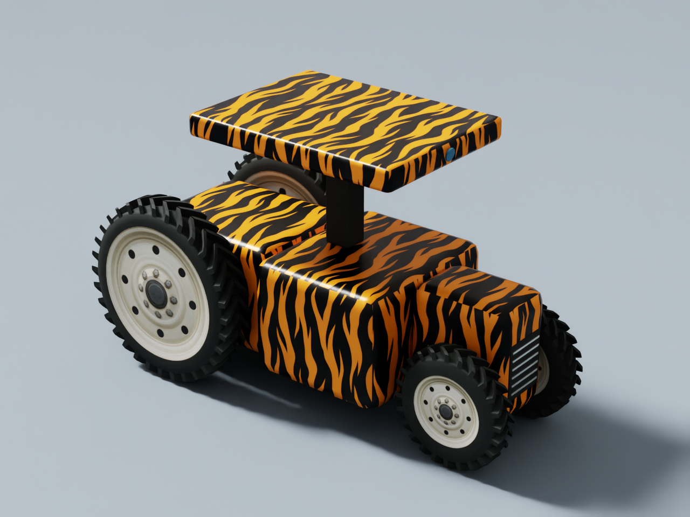
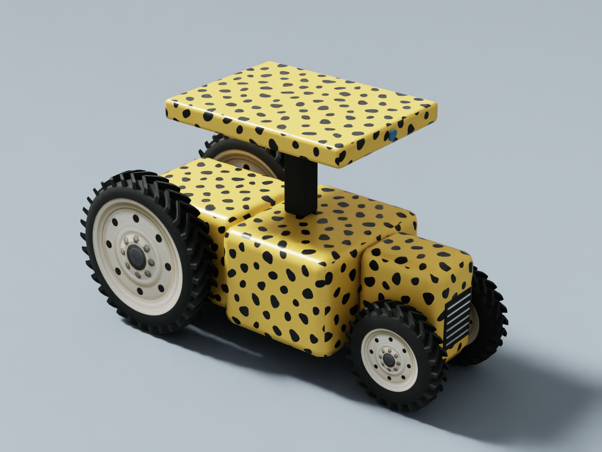

# farm-generator
Procedural farm generation via intermediate representation for robotics simulations. Tools for conversion to (minimally) IsaacSim/USD.

See `CLAUDE.md` for the full architecture/design reference.

## Setup

Farm and vegetation generation use the `usd2508` conda environment. Tractor
generation and interactive simulation use the separate `isaacsim61-cu13`
environment described in [Tractor generation and bringup](#tractor-generation-and-bringup),
because those workflows require Isaac Sim 6.1's bundled USD and PhysX schemas.

```bash
conda activate usd2508
pip install -e ".[dev]"
```

That installs this package (editable) plus its runtime dependencies (numpy,
shapely, networkx, scipy, matplotlib, pyyaml) and dev dependencies (pytest),
all pinned in `pyproject.toml`. Re-run the `pip install` after pulling
changes that touch `pyproject.toml`.

If `usd2508` doesn't exist yet on your machine: `conda create -n usd2508
python=3.12` (any Python >= 3.10 works), then activate and `pip install` as
above.

## Running the tests

```bash
conda activate usd2508
python -m pytest tests/ -q
```

## Running the debug visualizer

`visualization/debug_view.py` is the primary dev tool (see CLAUDE.md
"Visualization"). Run it as a module from the repo root:

```bash
conda activate usd2508
python -m visualization.debug_view
```

This generates a farm for 5 seeds and writes, per seed, into
`debug_out/farm_scenes/`:
- `farm_seed_<N>.png` — a static plot (parcels/roads/crossings/trees/weed
  zones), at 300 DPI so tree-level detail is actually legible.
- `farm_seed_<N>.yaml` — the full `FarmScene` IR plus the
  `FarmGenerationConfig` that produced it (see `farm_ir/serialize.py`),
  human-readable and round-trippable. This is what a future USD/Gazebo
  exporter will read as input.

`debug_out/` is scratch output (gitignored, aside from whatever's already
checked in for reference) — safe to delete and regenerate at any time.

## Running the example prototype

`examples/farm_mesh_prototype.py` is a self-contained reference prototype
(see CLAUDE.md "Example reference code") — read it as a spec of behavior,
not production code. Run directly:

```bash
conda activate usd2508
python examples/farm_mesh_prototype.py
```

It generates and validates 5 seeds and saves plots to
`debug_out/examples/`.

## Generating tree and weed assets

The vegetation geometry is generated procedurally rather than sourced from a
library of predefined or licensed tree and weed models. The asset-generation
algorithms were originally developed in the
[FarmGeneration repository](https://github.com/StuartGJohnson/FarmGeneration)
and copied into `generation/asset_generation/` so this repository can build
the same assets independently.

Run the standalone asset build from the repository root:

```bash
conda activate usd2508
python examples/generate_procedural_assets.py
```

This creates four seeded pecan-tree variants and one seeded prototype for each
of dry grass, fennel, and ashweed under `debug_out/procedural_assets/`. The
tree generator constructs trunks, branching structure, and leaf geometry and
procedurally creates the bark and leaf textures. The weed generators construct
species-specific stems, blades, leaves, and flowers as appropriate, along with
their textures. The current tree seeds are 101, 202, 303, and 404; weed seeds
are 101, 202, and 303. Reusing the same seeds produces repeatable USDA geometry
and texture files.

Asset generation is deliberately separate from farm and mesh generation.
Farm export expects the prototype library to exist already and references its
USDA files through tree and weed `PointInstancer` prototypes. It does not
silently regenerate assets. Each farm seed then determines the prototype
choice, rotation, and scale at each vegetation placement without modifying the
underlying asset files.

## Generating hydrology ground meshes

Run `python examples/generate_procedural_assets.py` first to build the reusable,
fully procedural tree and weed prototype library. Then run
`python examples/generate_ground_meshes.py` to generate five 60 m by 60 m farm
IRs and corresponding USDA worlds in `debug_out/mesh/`. All five diagnostic
farms enable optimized tree-row orientation. Run
`python examples/generate_showcase_farm.py` separately to build the larger
120 m by 120 m presentation scene without replacing those regression cases.
The exporter uses deterministic Poisson-disc (blue-noise) points, producing
an amorphous Delaunay/Voronoi-dual mesh, plus exact constrained breaklines at
the shoulders and flat bottoms of the trapezoidal irrigation channels.
Each seed also produces a wireframe PNG showing all vertices, triangle edges,
and constrained breaklines classified by source: road boundaries in red,
channel contours in orange, and crossing/channel-slope intersections in purple.

The example enables exporter-side lateral channel undulation with a 10 cm
maximum amplitude, wavelengths strictly greater than 1 m, and 1 m curve
sampling. `ChannelUndulationConfig` controls these values and an optional seed
offset. Perturbations are deterministic per farm seed and logical hydrology
edge, taper to zero at network nodes, and are applied before deriving both the
channel shoulder and bottom breaklines. The `FarmScene` IR is not modified.

Before constructing the PSLG, the exporter creates first-class `ChannelFace`
objects. Each face corresponds to one parcel-side hydrology edge and owns its
paired shoulder and bottom arcs, exact shared corner endpoints, depth, and
endpoint cross-slope ribs. GEOS computes valid offset contours; those contours
are split at analytically determined corner stations and mapped one-to-one to
their source hydrology edges. This avoids recovering corners by nearby-vertex
indices and provides a reusable surface-patch representation for later roads
and bridge approaches.

At every authored parcel corner, a transverse PSLG breakline connects the
shoulder to the bottom contour. This prevents constrained Delaunay from
choosing its own miter across the channel slope and establishes a reusable
surface-patch convention for later roads and structures.

The example uses a 3.5 m road standoff, 7.5 m headlands, and 6.5 m sidelands.
Straight 4 m-wide roads are represented as first-class `RoadSurfacePatch`
footprints. Road boundaries are PSLG constraints, and their triangles are
exported in the USD `RoadFaces` geometry subset for later material binding.

Road footprints replace, rather than overlay, the underlying terrain mesh.
Channel constraints are clipped out wherever a road exists, road-side boundary
vertices are placed at road elevation, and explicit vertical triangles close
the channel-facing solid fill sides. No crossing-specific constraints cut
across the road top. Wall faces are exported in the `CrossingWalls` subset.
Each crossing is associated with the hydrology segment that geometrically
passes through its location, rather than by channel-midpoint proximity. The
purple wireframe diagnostics therefore cover the crossing/channel-slope
intersections at every crossing, including long channel segments.

Channel water is controlled by `hydrology_add_water` and
`hydrology_water_depth_fraction` in `FarmGenerationConfig`; the latter is the
filled fraction measured upward from the channel bottom. The waterline becomes
an additional ground-mesh PSLG contour. Each connected water polygon, after
subtracting road fills, is exported as a separate constrained `WaterSurface_*`
mesh with a transparent, reflective `UsdPreviewSurface` material, low
roughness, and an index of refraction of 1.333. The debug example enables water
at half channel depth and draws its closed boundaries in cyan.

Each USDA is a complete `/World` stage rather than a bare ground primitive. It
includes a `/World/Lights/Sky` dome light using
`assets/dome_texture_clouds.png`, a shadow-casting distant sun, a
gravity-enabled physics scene, and a static ground mesh collider. Material
geometry subsets map crushed grass to flat cropland, the channel texture to
slopes, bottoms, and vertical crossing walls, and darker gravel to road decks.
Face-varying world-space UVs repeat every texture at 2 m intervals. Vertical
crossing walls use horizontal-distance/elevation projection so their texture
does not collapse, while remaining independently identified by the
`CrossingWalls` subset.

Trees and weeds are authored as separate USD `PointInstancer` systems under
`/World/Vegetation`. Tree positions come directly from the farm IR. Each IR
weed zone records the exact cultivated row centerlines; weeds are sampled only
from Gaussian lateral profiles around those rows while excluding road and
channel footprints. `weed_row_density_per_m` is the expected instance count per
metre of row, integrated laterally, and `weed_row_falloff_m` is the lateral
standard deviation. Sampling is truncated at three standard deviations, with
no parcel-wide background weeds. Both systems reference the separately
generated prototype library; exporting a farm never silently generates or
mutates those assets. The diagnostic configuration uses 5 m row spacing and
4 m tree spacing and 4.5 expected weeds per row-metre. The current procedural
library contains four deterministic pecan-tree variants plus dry grass,
fennel, and ashweed. Individual tree and weed instances receive independently
seeded, repeatable random rotations about the vertical axis and modest scale
variation. Setting `optimize_tree_layout=True` retains the random
planting-grid anchor corner but uses the longer of its two incident parcel
edges as the tree-row direction; the default `False` preserves randomized
edge selection for layouts requiring more turns.

## 120 m showcase pecan farm


This is an HD Isaac Sim render of the 120 m by 120 m showcase pecan farm generated
by `examples/generate_showcase_farm.py`. This is modeled on flat, irrigated farmland
typical of the Sacramento Delta in California. Seed 1 produced 4 parcels, 16 channel
segments, 6 channel crossings, 453 trees selected from four procedural tree
variants, and 8,356 weeds concentrated along the optimized tree rows. The
complete run—including IR generation, ground and water meshing, USDA writing,
and diagnostic rendering—took approximately 2 minutes 10 seconds on the
development machine. The resulting USDA contains 33,616 ground vertices and
52,003 ground triangles and is written as
`debug_out/mesh/farm_seed_1_120m2_ground.usda`.



The mesh detail above is a plan-view crop covering x=60–100 m and y=60–100 m
in the same East-right, North-up orientation as the full diagnostics. Gray
lines are Delaunay triangle edges, blue dots are mesh vertices, red lines are
road constraints, orange lines are channel constraints, cyan lines are water
boundaries, and purple markers identify crossing/channel-slope constraints. This
mesh is constrained to have edges along the channels, roads (and channel crossings)
and the farm parcels. The resolution of the mesh is nominally 1m in order to
sample variations in height and surface friction.

## Generating a farm programmatically

```python
from generation.orchestrator import FarmGenerationConfig, generate_validated, save_farm

config = FarmGenerationConfig(bounds=(0.0, 0.0, 100.0, 100.0), seed=1)
scene, issues, used_seed = generate_validated(config)
save_farm(scene, config, "my_farm.yaml")
```

## Tractor generation and bringup

The tractor is generated deterministically from
`configs/tractor_default.yaml`. The current model uses PhysX 5 Vehicle 2 with
rear-wheel drive, Ackermann steering, independent wheel suspension, tire
friction, a compound collision body with wheel clearances, and a pitched RGB
camera in the sensor pod. Wheel attachment, collision, and render frames are
authored separately to accommodate Vehicle 2's managed wheel transforms while
remaining correct both before and during simulation. Matching link, wheel,
joint, and camera names are used in the USDA and URDF outputs.

Isaac Sim is intentionally not a dependency in `pyproject.toml`: it is a large,
platform-specific application and supplies its own compatible OpenUSD and
`PhysxSchema` builds. Install Isaac Sim 6.1 separately, create or activate an
environment that exposes its Python packages, and then install this repository
into that environment. On the development machine the environment is named
`isaacsim61-cu13`:

```bash
conda activate isaacsim61-cu13
python -m pip install -e ".[dev]"
```

Avoid importing an unrelated PyPI OpenUSD build in
the same process as Isaac Sim, since mixed USD builds can cause ABI and singleton
conflicts.

Generate the tractor assets from the repository root with:

```bash
conda activate isaacsim61-cu13
python examples/generate_tractor.py
```

The command does not launch `SimulationApp`. It configures a subprocess to use
Isaac Sim's bundled USD libraries and writes the following files under
`debug_out/tractor/`:

- `tractor.usda` — the complete reusable Vehicle 2 tractor asset.
- `tractor.urdf` — the corresponding ROS-oriented robot description.
- `tractor_diagnostic.png` — lightweight side and plan geometry diagnostics.
- `textures/` — the selected livery PNG, referenced relative to the USDA.

The USD tractor uses `tiger_stripes` (orange/black) or `cheetah_spots`
(ochre/black) paint textures on every body panel and the sensor pod. Low-poly
rounded panels follow the compound body's wheel-clearance envelope, with a
rounded pod, dark pod support, and front grille. These are cosmetic meshes;
the original collision boxes, vehicle mass, inertia, and wheel frames remain
unchanged. Collision boxes use USD's `guide` purpose. The URDF remains the
simplified geometry description and does not include this USD appearance.
Keep the `textures` directory beside the USDA when moving an exported tractor.

Wheels have rounded rubber sidewalls, raised agricultural chevron tread, and
textured steel dish rims on both sides. `front_tire_depth` and `rear_tire_depth`
default to **0.2 m** and control radial rubber thickness (outer tire radius minus
rim radius). The raised lugs use part of that thickness; they do not increase
the configured tire diameter or width. All wheel detail is collision-free and
leaves rolling radius, wheel mass/inertia, suspension, and friction unchanged.
The original `Render` cylinder remains a hidden guide for axle diagnostics.
Wheel texture provenance and prompt are in
[`tractor_generation/assets/wheels/`](tractor_generation/assets/wheels/).

Render both liveries with Isaac Sim on a GPU:

```bash
conda run -n isaacsim61-cu13 python examples/render_tractor.py
```

This writes `tractor.png`, a reusable `tractor.usda`, and a lit `studio.usda`
under each livery directory in `debug_out/tractor/livery_preview/`. The preview
holds simulation time fixed; it is an appearance check, not a driving test.
Use `--config PATH` and `--output-dir PATH` to preview other dimensions.
Source textures and their generation prompts are in
[`tractor_generation/assets/livery/`](tractor_generation/assets/livery/).

Example renderings of the upgraded tractor appearance:

- [Tiger-stripe tractor](debug_out/tractor/livery_preview/tiger_stripes/tractor.png):
  an AI-generated orange-and-black stripe texture mapped onto the rounded body
  panels and sensor pod using `livery: tiger_stripes`.

  

- [Cheetah-spot tractor](debug_out/tractor/livery_preview/cheetah_spots/tractor.png):
  an AI-generated ochre-and-black spot texture applied to the same geometry
  using `livery: cheetah_spots`.

  

Both PNGs were rendered at 1280 × 960 in headless Isaac Sim 6.1 on an RTX 2070,
using a studio floor, lighting, and a three-quarter camera view. Replicator's
RGB annotator captured the actual USD geometry and materials. Both tractors
have procedural chevron tread, 0.2 m radial rubber thickness, and dished hubs
with an AI-generated steel-wheel texture; image generation supplied only the
texture assets, while Isaac Sim produced the final renderings.

An alternative YAML file may be supplied as the first positional argument,
and `--output-dir` selects a different destination:

```bash
python examples/generate_tractor.py configs/tractor_default.yaml \
  --output-dir debug_out/tractor
```

To compose the generated tractor into the 120 m showcase farm and drive it
interactively, run:

```bash
python -m bringup.launch_tractor --position 20 3.5 0
```

The selected position starts the tractor on the lower horizontal gravel road.
The launcher starts Isaac Sim, references the farm and tractor assets under one
`/World`, disables the tractor asset's nested convenience physics scene, and
uses the farm's `/World/PhysicsScene` as the authoritative Vehicle 2 context.
Click the viewport before driving. Controls are `W` forward, `S` reverse,
`A`/`D` steering, and Space for the brake. Select `/World/Tractor/base_link`
and press `F` to frame the tractor in the viewport.

The optional runtime frame report is useful when changing wheel geometry or
Vehicle 2 settings:

```bash
python -m bringup.launch_tractor \
  --position 20 3.5 0 \
  --frame-report
```

It writes `debug_out/tractor/runtime_frame_report.txt` after simulation has
initialized. `--headless` suppresses the interactive window. `--ros2` also
enables the ROS 2 bridge and creates camera publishing graphs. ROS 2 Humble
bringup currently expects:

```bash
export ROS_DISTRO=humble
export RMW_IMPLEMENTATION=rmw_fastrtps_cpp
export LD_LIBRARY_PATH="$LD_LIBRARY_PATH:/home/sjohnson/anaconda3/envs/isaacsim61-cu13/lib/python3.12/site-packages/isaacsim/exts/isaacsim.ros2.core/humble/lib"
python -m bringup.launch_tractor --position 20 3.5 0 --ros2
```

Run the focused generation tests without starting Isaac Sim:

```bash
python -m pytest tests/test_tractor_generation.py -q
```

The standalone scripts in `examples/autocompute_tractor_frames.py` and
`examples/inspect_tractor_runtime_frames.py` are targeted debugging tools for
an already open Isaac Sim stage; normal generation and driving do not require
them.

## AI assistance

ChatGPT 5.6 (OpenAI, 08/2026), Codex CLI (gpt-5.6-sol, OpenAI, 08/2026), Claude Code 2.1.248 CLI (Anthropic, 08/20206) and Google Antigravity 1.0.14 CLI (Google, 08/2026) were used to assist in the creation of this repo. In particular, the python code is entirely AI created, with git operations, feedback, debugging help, and generation of .md file instructions by Stuart Johnson.
